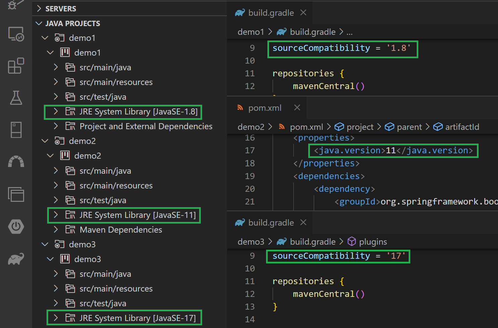

# Java Extension Pack with JDK

Just by installing this extension, you can start Java development right out of the box without installing JDK or setting environment variables.
  

# Features

## Multiple JDK versions included
Includes Adoptium Java 8, 11, 17 and auto-configures java.configuration.runtimes 
License: MIT (Adoptium: GPL v2 with the Classpath Exception)

 

# Extensions Included

- [📦 Extension Pack for Java](https://marketplace.visualstudio.com/items?itemName=vscjava.vscode-java-pack) (Microsoft) 
IntelliSense, Refactoring, Debugger, Maven, Lombok, etc... 
License: MIT
- [📦 Gradle for Java](https://marketplace.visualstudio.com/items?itemName=vscjava.vscode-gradle) (Microsoft) 
Syntax highlighting, Task Panel, Run tasks 
License: MIT
- [📦 Spring Boot Extension Pack](https://marketplace.visualstudio.com/items?itemName=vmware.vscode-boot-dev-pack) (VMWare) 
Spring Initializr, Boot Dashboard, Properties Support 
License: EPL-1.0
- [📦 Community Server Connectors](https://marketplace.visualstudio.com/items?itemName=redhat.vscode-community-server-connector) (Red Hat) 
Servers Panel, Start/Stop (Tomcat, Glassfish, etc...), Server download and installation 
License: EPL-2.0
